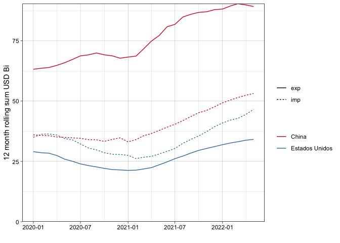

<!-- README.md is generated from README.Rmd. Please edit that file -->

# comexstatr

<!-- badges: start -->

[](https://lifecycle.r-lib.org/articles/stages.html#experimental)
[](https://CRAN.R-project.org/package=comexstatr)
<!-- badges: end -->

The goal of comexstatr is to make it easy to download, process, and
analyze Brazilian foreign trade statistics, available through the web
app <http://comexstat.mdic.gov.br/>, using the underlying bulk data
<https://www.gov.br/produtividade-e-comercio-exterior/pt-br/assuntos/comercio-exterior/estatisticas/base-de-dados-bruta>.

## Installation

You can install the development version of comexstatr cloning the repo
from github (with git lfs installed) and installing locally.

``` r
```

## Example

``` r
library(comexstatr)
library(dplyr)
#> 
#> Attaching package: 'dplyr'
#> The following objects are masked from 'package:stats':
#> 
#>     filter, lag
#> The following objects are masked from 'package:base':
#> 
#>     intersect, setdiff, setequal, union
library(ggplot2)
## imports and exports from china and usa after 2019, 12 month rolling sum
qplot(co_ano_mes, vl_fob_12_sum_bi, data=comex_roll12p%>%
  filter(co_ano_mes>="2020-01-01", pais%in%c("China", "Estados Unidos"))%>%
  group_by(co_ano_mes, fluxo, pais)%>%
  summarise(vl_fob_12_sum_bi=sum(vl_fob_12_sum)/1e9), color=pais, geom="line", linetype=fluxo) +
  scale_y_continuous(limits=c(0,NA), expand=c(0,0))+
  theme_linedraw() + labs(x="", y="12 month rolling sum USD Bi", linetype="", color="") +
  scale_color_brewer(palette = "Set1")
#> `summarise()` has grouped output by 'co_ano_mes', 'fluxo'. You can override
#> using the `.groups` argument.
```

