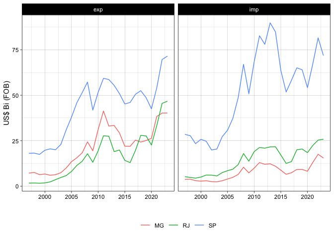

<!-- README.md is generated from README.Rmd. Please edit that file -->

# comexstatr

<!-- badges: start -->

[](https://lifecycle.r-lib.org/articles/stages.html#experimental)
[](https://CRAN.R-project.org/package=comexstatr)
<!-- badges: end -->

The goal of comexstatr is to make it easy to download, process, and
analyze Brazilian foreign trade statistics, available through the web
app <http://comexstat.mdic.gov.br/>, using the underlying bulk data
<https://www.gov.br/produtividade-e-comercio-exterior/pt-br/assuntos/comercio-exterior/estatisticas/base-de-dados-bruta>.

## Installation

``` r
##devtools::install_github("leoniedu/comexstatr")
```

If you have problems installing arrow, see:

<https://arrow.apache.org/docs/r/articles/install.html>

## Examples

``` r
library(comexstatr)
library(dplyr)
```

    ## 
    ## Attaching package: 'dplyr'

    ## The following objects are masked from 'package:stats':
    ## 
    ##     filter, lag

    ## The following objects are masked from 'package:base':
    ## 
    ##     intersect, setdiff, setequal, union

``` r
##downloading

try(comexstat_download())
```

    ## Downloading data from Comexstat...

    ## Increasing timeout limit ...

``` r
## might need something like this if you get ssl errors. 
# try(comexstat_download(method="wget", extra="--no-check-certificate"))
## if R Session is aborted, try a different download method (e.g. curl, rcurl, wget)
```

Automatic downloading can be tricky, due to timeout, (lack of) valid
security certificates on the Brazilian government websites, along other
issues.

Everytime one calls comexstat_download it resets the memoisation of the
package (which is used to speed up results) and checks the local cache
against the validation file in the website. It will download the data if
this fails.

### Main trade partners, treating countries in Mercosul and European Union as blocks.

Using a programming language like R makes it easy to generate statistics
and reports at the intended level of analysis.

``` r
msul <- comexstat("pais_bloco")|>
  filter(co_bloco==111)|>
  pull(co_pais)
eu <- comexstat("pais_bloco")|>
  filter(co_bloco==22)|>
  pull(co_pais)

pb <- comexstat("pais")|>
  transmute(co_pais, 
            partner=
              case_when(co_pais%in%msul ~ "Mercosul",
                        co_pais%in%eu ~ "European Union",
                        TRUE ~ no_pais_ing)
              )

cstat_top_0 <- comexstat()|>
  left_join(pb) |> 
  #filter(co_ano>=2017)|>
  group_by(partner)|>
  summarise(vl_fob=sum(vl_fob))|>
  ungroup() |> 
  arrange(desc(vl_fob))|>
  collect()|>
  slice(1:5)

cstat_top <- comexstat() |>
  left_join(pb) |> 
  #filter(co_ano>=2017)|>
  semi_join(cstat_top_0, by=c("partner"))|>
  group_by(co_ano, partner, fluxo)|>
  summarise(vl_fob=sum(vl_fob))|>
  collect()

library(ggplot2)
ggplot(aes(x=as.numeric(co_ano), 
           y=vl_fob_bi), 
       data=cstat_top|>
         filter(co_ano<2023)|>
         mutate(vl_fob_bi=vl_fob/1e9)) +
  geom_line(aes(color=partner)) +
  facet_wrap(~fluxo) +
  labs(color="", x="", y="US$ Bi (FOB)") +
  theme_linedraw() + theme(legend.position="bottom")
```

<!-- -->

### Imports and exports by Brazilian state

You will have access to information not available via the web interface
<http://comexstat.mdic.gov.br/en/home>, such as

``` r
bystate <- comexstat() |> 
  filter(co_ano<2023) |>
  group_by(state=sg_uf_mun, co_ano, fluxo)|>
  summarise(vl_fob=sum(vl_fob))|>
  collect()

topstate <- bystate|>
  group_by(state)|>
  summarise(vl_fob=sum(vl_fob))|>
  arrange(-vl_fob)|>
  head(3)


ggplot(aes(x=as.numeric(co_ano), y=vl_fob_bi, color=state), 
       data=bystate|>
        semi_join(topstate, by="state")|>
        mutate(vl_fob_bi=vl_fob/1e9)) +
  geom_line() +
  facet_wrap(~fluxo) +
  labs(color="", x="", y="US$ Bi (FOB)") +
  theme_linedraw() + theme(legend.position="bottom")
```

<!-- -->

## Deflate using CPI (for USD) or IPCA (for BRL) (Experimental)

``` r
selected_deflated <- comexstat()%>%
  filter(co_pais%in%c("249", "160", "063"))%>%
  group_by(fluxo, co_ano_mes, co_pais)%>%
  summarise(vl_fob=sum(vl_fob), vl_cif=sum(vl_cif, na.rm=TRUE))%>%
  comexstat_deflated()%>%
  collect()

library(runner)
selected_deflated_r <- selected_deflated%>%
  left_join(comexstat("pais"))%>%
  group_by(fluxo, co_pais, no_pais_ing)%>%
  arrange(co_ano_mes)%>%
  filter(!is.na(vl_fob_constant_usd))%>%
  mutate(vl_fob_constant_usd=
           slider::slide_index_dbl(.x=vl_fob_constant_usd, 
                                   .before = months(11),
                                   .complete = TRUE,
                                   .f = function(z) sum(z, na.rm=TRUE), .i = co_ano_mes)/1e9)
```

    ## Joining with `by = join_by(co_pais)`

``` r
ggplot(aes(x=co_ano_mes, y=vl_fob_constant_usd, color=no_pais_ing), 
       data=selected_deflated_r) +
  facet_wrap(~fluxo)+
  geom_line() +
  labs(color="", x="", y="US$ Bi (FOB) Deflated by CPI "%>%paste0(format(max(selected_deflated_r$co_ano_mes), "%m/%Y")), caption = "* 12 month rolling sums") +
  theme_linedraw() + theme(legend.position="bottom") #+ scale_color_manual(values=c("red",  "blue")) 
```

    ## Warning: Removed 33 rows containing missing values (`geom_line()`).

<!-- -->

## Saldo comercial

``` r
saldo_deflated <- comexstat()%>%
  group_by(fluxo, co_ano_mes)%>%
  summarise(vl_fob=sum(vl_fob), vl_cif=sum(vl_cif, na.rm=TRUE), qt_estat=sum(qt_estat, na.rm=TRUE))%>%
  comexstat_deflated()%>%
  collect()

library(runner)
nperiods <- 11
saldo_deflated_r <- saldo_deflated%>%
  group_by(fluxo)%>%
  arrange(co_ano_mes)%>%
  filter(!is.na(vl_fob_constant_usd))%>%
  mutate(
    vl_fob_usd_bi=
      slider::slide_index_dbl(.x=vl_fob, 
                              .before = months(nperiods),
                              .complete = TRUE,
                              .f = function(z) sum(z, na.rm=TRUE), .i = co_ano_mes)/1e9,
    vl_fob_brl_bi=
      slider::slide_index_dbl(.x=vl_fob*brlusd, 
                              .before = months(nperiods),
                              .complete = TRUE,
                              .f = function(z) sum(z, na.rm=TRUE), .i = co_ano_mes)/1e9,
    vl_fob_constant_usd=
      slider::slide_index_dbl(.x=vl_fob_constant_usd, 
                              .before = months(nperiods),
                              .complete = TRUE,
                              .f = function(z) sum(z, na.rm=TRUE), .i = co_ano_mes)/1e9,
    vl_fob_constant_brl=
      slider::slide_index_dbl(.x=vl_fob_constant_brl, 
                              .before = months(nperiods),
                              .complete = TRUE,
                              .f = function(z) sum(z, na.rm=TRUE), .i = co_ano_mes)/1e9
    )%>%
  mutate(vl_fob_constant_usd_i=vl_fob_constant_usd/vl_fob_constant_usd[co_ano_mes=="2022-01-01"])

corrente_deflated_r <- saldo_deflated_r%>%
  group_by(co_ano_mes)%>%
  summarise(across(matches("^(vl_|qt_)"), sum))

ggplot(aes(x=co_ano_mes, y=vl_fob_constant_usd, color=fluxo), 
       data=saldo_deflated_r) +
  scale_color_manual(values=c("blue", "red")) +
  geom_line() +
  geom_line(aes(y=vl_fob_usd_bi), linetype='dashed')+
  labs(color="", x="", y="US$ Bi (FOB) Deflated by CPI "%>%paste0(format(max(selected_deflated_r$co_ano_mes), "%m/%Y")), caption = "* 12 month rolling sums") +
  theme_linedraw() + 
  geom_vline(xintercept=as.Date("2023-01-01"))+
  theme(legend.position="bottom") #+ scale_color_manual(values=c("red",  "blue")) 
```

    ## Warning: Removed 22 rows containing missing values (`geom_line()`).
    ## Removed 22 rows containing missing values (`geom_line()`).

<!-- -->

### Somente Dezembro (anos completos)

``` r
ggplot(aes(x=co_ano_mes, y=vl_fob_constant_brl, color=fluxo), 
       data=saldo_deflated_r%>%filter(lubridate::month(co_ano_mes)==12)) +
  scale_color_manual(values=c("blue", "red")) +
  geom_line() +
  geom_line(aes(y=vl_fob_brl_bi), linetype='dashed')+
  geom_point(aes(y=vl_fob_brl_bi), linetype='dashed')+
  labs(color="", x="", y="R$ Bi (FOB) Deflated by IPCA "%>%paste0(format(max(selected_deflated_r$co_ano_mes), "%m/%Y")), caption = "* 12 month rolling sums") +
  theme_linedraw() + 
  geom_vline(xintercept=as.Date("2023-01-01"))+
  theme(legend.position="bottom") #+ scale_color_manual(values=c("red",  "blue")) 
```

    ## Warning in geom_point(aes(y = vl_fob_brl_bi), linetype = "dashed"): Ignoring
    ## unknown parameters: `linetype`

<!-- -->

``` r
ggplot(aes(x=co_ano_mes, y=saldo_constant_usd), 
       data=
         saldo_deflated_r%>%
         group_by(co_ano_mes)%>%
         arrange(desc(fluxo))%>%
         summarise(saldo_constant_usd=vl_fob_constant_usd[2]-vl_fob_constant_usd[1])%>%
         na.omit()
                   )+
  #scale_color_manual(values=c("blue", "red")) +
  geom_line() +
  labs(color="", x="", y="USD$ Bi (FOB) Deflated by CPI "%>%paste0(format(max(selected_deflated_r$co_ano_mes), "%m/%Y")), caption = "* 12 month rolling sums") +
  theme_linedraw() + 
  theme(legend.position="bottom") #+ scale_color_manual(values=c("red",  "blue")) 
```

<!-- -->

### BRL

``` r
ggplot(aes(x=co_ano_mes, y=saldo_constant_brl), 
       data=
         saldo_deflated_r%>%
         group_by(co_ano_mes)%>%
         arrange(desc(fluxo))%>%
         summarise(saldo_constant_brl=vl_fob_constant_brl[2]-vl_fob_constant_brl[1])%>%
         na.omit()
                   )+
  #scale_color_manual(values=c("blue", "red")) +
  geom_line() +
  labs(color="", x="", y="R$ Bi (FOB) Deflated by IPCA "%>%paste0(format(max(selected_deflated_r$co_ano_mes), "%m/%Y")), caption = "* 12 month rolling sums") +
  theme_linedraw() + 
  theme(legend.position="bottom") #+ scale_color_manual(values=c("red",  "blue")) 
```

<!-- -->

## 6 dígitos

``` r
by_dig <- comexstat() |> 
  filter(co_ano>=2022) |>
  group_by(hs_dig=substr(co_ncm,1,6), fluxo, co_ano=lubridate::year(co_ano_mes))|>
  summarise(vl_fob=sum(vl_fob))|>
  collect()|>
  tidyr::pivot_wider(names_from=c("fluxo", "co_ano"), values_from = vl_fob)%>%
  mutate(ep=exp_2023-exp_2022-1, ip=imp_2023-imp_2022-1, si=imp_2022+imp_2023)%>%
  arrange(desc(si))%>%
  head(30)
```

``` r
ggplot(aes(y=hs_dig, x=ip), data=by_dig) + geom_col()
```

<!-- -->
