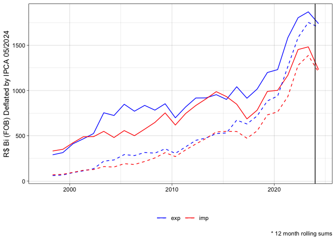
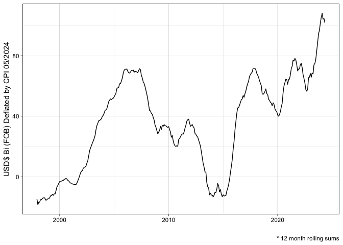

<!-- README.md is generated from README.Rmd. Please edit that file -->

# comexstatr

<!-- badges: start -->

[](https://lifecycle.r-lib.org/articles/stages.html#experimental)
[](https://CRAN.R-project.org/package=comexstatr)
<!-- badges: end -->

The goal of comexstatr is to make it easy to download, process, and
analyze Brazilian foreign trade statistics, available through the web
app <http://comexstat.mdic.gov.br/>, using the underlying bulk data
<https://www.gov.br/produtividade-e-comercio-exterior/pt-br/assuntos/comercio-exterior/estatisticas/base-de-dados-bruta>.

## Installation

``` r
##devtools::install_github("leoniedu/comexstatr")
```

If you have problems installing arrow, see:

<https://arrow.apache.org/docs/r/articles/install.html#:~:text=Step%201%20-%20Using%20a%20computer%20with%20internet,created%20my_arrow_pkg.tar.gz%20to%20the%20computer%20without%20internet%20access>

## Examples

``` r
library(comexstatr)
library(dplyr)
```

    ## 
    ## Attaching package: 'dplyr'

    ## The following objects are masked from 'package:stats':
    ## 
    ##     filter, lag

    ## The following objects are masked from 'package:base':
    ## 
    ##     intersect, setdiff, setequal, union

``` r
##downloading
## might need to set the timeout option
options(timeout=max(options("timeout")$timeout, 600))

try(comexstat_download())
```

    ## Downloading data from Comexstat...

``` r
## might need something like this if you get ssl errors. 
try(comexstat_download(method="wget", extra="--no-check-certificate"))
```

    ## Downloading data from Comexstat...

    ## Warning in system(paste("wget", paste(extra, collapse = " "), shQuote(url), :
    ## error in running command

    ## Error in download.file(..., destfile = destfile) : 
    ##   'wget' call had nonzero exit status

``` r
## if R Session is aborted, try a different download method (e.g. curl, rcurl, wget)
```

Automatic downloading can be tricky, due to timeout, (lack of) valid
security certificates on the Brazilian government websites, along other
issues.

Everytime one calls comexstat_download it resets the memoisation of the
package (which is used to speed up results) and checks the local cache
against the validation file in the website. It will download the data if
this fails.

### Main trade partners, treating countries in Mercosul and European Union as blocks.

``` r
msul <- comexstat("pais_bloco")%>%
  filter(co_bloco==111)%>%
  pull(co_pais)
eu <- comexstat("pais_bloco")%>%
  filter(co_bloco==22)%>%
  pull(co_pais)

pb <- comexstat("pais")%>%
  transmute(co_pais, 
            partner=
              case_when(co_pais%in%msul ~ "Mercosul",
                        co_pais%in%eu ~ "European Union",
                        TRUE ~ no_pais_ing)
              )

cstat_top_0 <- comexstat()|>
  left_join(pb) |> 
  #filter(co_ano>=2017)|>
  group_by(partner)|>
  summarise(vl_fob=sum(vl_fob))|>
  ungroup() |> 
  arrange(desc(vl_fob))|>
  collect()|>
  slice(1:5)

cstat_top <- comexstat() |>
  left_join(pb) |> 
  #filter(co_ano>=2017)%>%
  semi_join(cstat_top_0, by=c("partner"))%>%
  group_by(co_ano, partner, fluxo)|>
  summarise(vl_fob=sum(vl_fob))%>%
  collect

library(ggplot2)
qplot(co_ano, vl_fob_bi, data=cstat_top%>%filter(co_ano<2023)%>%mutate(vl_fob_bi=vl_fob/1e9), color=partner, geom="line") +
  facet_wrap(~fluxo) +
  labs(color="", x="", y="US$ Bi (FOB)") +
  theme_linedraw() + theme(legend.position="bottom")
```

<!-- -->

## By ISIC - International Standard Industrial Classification of All Economic Activities

``` r
isic <- comexstat() |> 
  left_join(ncms()%>%select(co_ncm, isic=no_isic_secao_ing))%>%
  group_by(isic, co_ano, fluxo)%>%
  summarise(vl_fob=sum(vl_fob))%>%
  collect


qplot(co_ano, vl_fob_bi, 
      data=isic%>%
        filter(co_ano<2023)%>%
        mutate(vl_fob_bi=vl_fob/1e9), color=isic, geom="line") +
  facet_wrap(~fluxo) +
  labs(color="", x="", y="US$ Bi (FOB)") +
  theme_linedraw() + theme(legend.position="bottom")
```

<!-- -->

### By state

``` r
bystate <- comexstat() |> 
  filter(co_ano<2023) |>
  group_by(state=sg_uf_ncm, co_ano, fluxo)%>%
  summarise(vl_fob=sum(vl_fob))%>%
  collect

topstate <- bystate%>%group_by(state)%>%summarise(vl_fob=sum(vl_fob))%>%arrange(-vl_fob)%>%head(3)


qplot(co_ano, vl_fob_bi, 
      data=bystate%>%
        semi_join(topstate, by="state")%>%
        mutate(vl_fob_bi=vl_fob/1e9), color=state, geom="line") +
  facet_wrap(~fluxo) +
  labs(color="", x="", y="US$ Bi (FOB)") +
  theme_linedraw() + theme(legend.position="bottom")
```

<!-- -->
